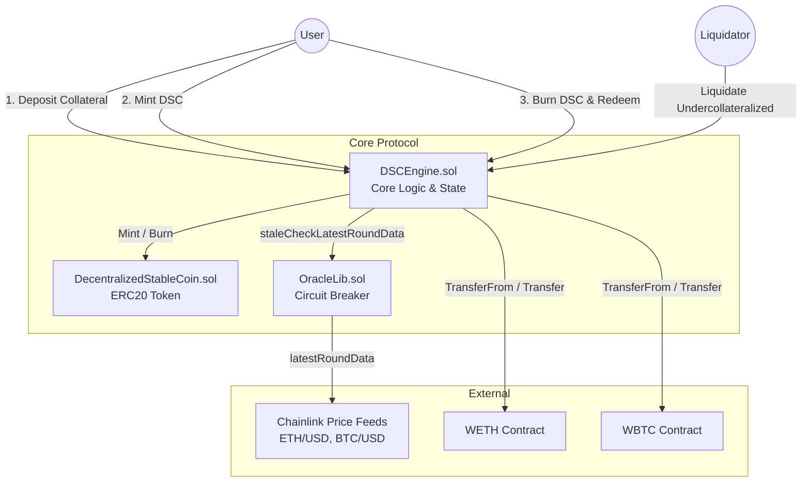

# 🪙 Decentralized Stablecoin (DSC) Protocol


A robust, algorithmically stable, exogenously collateralized, and dollar-pegged stablecoin system built with Foundry. 

The system is designed to be as minimal and secure as possible, maintaining a `1 DSC == $1` peg at all times. It shares similarities with MakerDAO's DAI but operates without governance or fees, and is backed exclusively by **WETH** and **WBTC**.

## 📖 Protocol Overview
* **Collateral:** Exogenous (WETH & WBTC)
* **Minting:** Algorithmic (Requires > 150% Overcollateralization)
* **Relative Stability:** Pegged to USD ($1.00)
* **Liquidation:** Undercollateralized positions (Health Factor < 1) can be liquidated by any user for a 10% bonus.

---

## 🏗️ System Architecture



## Security & Invariants (Audit Prep)
This protocol has been developed with a "security-first" mindset, featuring advanced testing methodologies and fail-safe mechanisms:

1. Stateful Fuzzing (Invariant Testing)
Traditional stateless fuzzing is insufficient for complex DeFi logic. We implemented a robust Handler.t.sol middleware to dynamically constrain randomized fuzzer inputs within valid business boundaries.

Core Invariant Asserted: Total Collateral Value (WETH + WBTC) >= Total DSC Supply

The test suite successfully sustains 16,000+ high-intensity randomized state changes without breaking the core economic invariants or causing unhandled panics.

2. Oracle Circuit Breaker (OracleLib)
The protocol relies on Chainlink for real-time collateral pricing. To prevent "Stale Price" exploits during severe network congestion or oracle downtime, we implemented a custom OracleLib.

Fail-Safe Mechanism: Enforces a hardcoded 3-hour heartbeat timeout on all Chainlink feeds.

If block.timestamp - updatedAt exceeds this threshold, the protocol intentionally fails-closed (freezing deposits, mints, and liquidations) to protect user funds from being drained using outdated prices.

## 💻 Usage (Foundry Toolkit)
This project uses Foundry, a blazing fast, portable and modular toolkit for Ethereum application development written in Rust.

Build
Compile the smart contracts:

```Bash
 forge build
```

Test
Run the comprehensive test suite (Unit Tests & Stateful Fuzzing):

```Bash
$ forge test
```

Format
Ensure code adheres to standard Solidity formatting guidelines:

```Bash
$ forge fmt
```
Gas Snapshots
Analyze and track gas usage across the protocol:

```Bash
$ forge snapshot
```
Local Network (Anvil)
Spin up a local Ethereum node for testing and frontend integration:

```Bash
$ anvil
```
Deploy
Deploy the protocol to a network (replace variables with your configuration):

```Bash
$ forge script script/DeployDSC.s.sol --rpc-url <your_rpc_url> --private-key <your_private_key>
(Note: Use Cast for interacting with the EVM and sending transactions from the command line).
```

## 📄 License
This project is licensed under the MIT License.