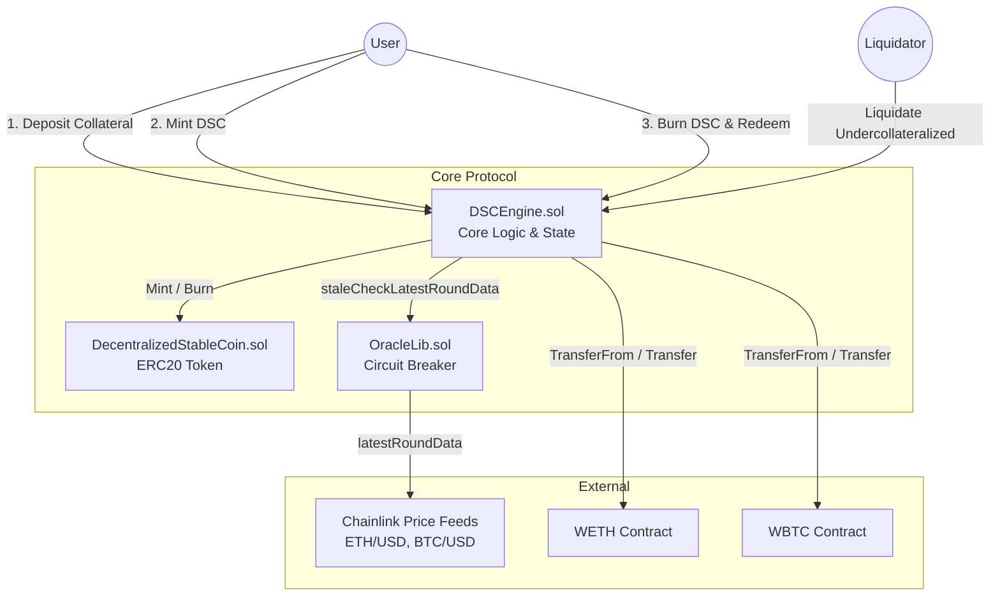

# 🪙 去中心化稳定币 (DSC) 协议


一个使用 Foundry 构建的健壮、算法稳定、外部抵押且严格锚定美元的去中心化稳定币系统。

该系统的架构设计追求极致的极简与安全，旨在任何情况下都能维持 `1 DSC == $1` 的价格锚定。它的底层逻辑类似于 MakerDAO 的 DAI，但移除了复杂的治理机制和手续费，且完全由 **WETH** 和 **WBTC** 作为底层价值背书。

## 📖 协议总览
* **抵押物：** 外部资产 (WETH & WBTC)
* **铸造机制：** 算法控制 (要求 > 150% 的超额抵押率)
* **相对稳定性：** 严格锚定美元 ($1.00)
* **清算机制：** 任何用户都可以对抵押不足的资不抵债仓位 (健康因子 Health Factor < 1) 发起清算，并获得 10% 的清算奖励。

---

## 🏗️ 系统架构



## 安全与不变量 (顶级审计预备)
本协议秉持“安全第一”的极客理念进行开发，在底层架构中引入了业界前沿的测试方法论与系统级防线：

1. 状态模糊测试 (Stateful Fuzzing / Invariant Testing)
传统的无状态模糊测试不足以应对 DeFi 协议中复杂的数学与状态逻辑。我们编写了强大的 Handler.t.sol 中间件，将 Fuzzer 的随机测试输入动态约束在合理的业务边界内。

核心不变量断言： 协议总抵押物价值 (WETH + WBTC) >= DSC 总供应量

本系统的测试套件成功扛住了 16,000+ 次高强度的并发随机状态变更，在此极限压力下，核心经济不变量未被打破，且未引发任何底层异常 (Panic)。

2. 预言机熔断机制 (OracleLib)
本协议完全依赖 Chainlink 获取实时的抵押物价格。为了防止在严重的区块链网络拥堵或节点大面积宕机期间发生“过期价格 (Stale Price)”漏洞，我们开发了专用的 OracleLib 库。

Fail-Safe (安全失效) 机制： 对所有的 Chainlink 喂价接口强制执行硬编码的 3 小时 心跳超时校验。

一旦发现 block.timestamp - updatedAt 超过此时效阈值，引擎将主动触发 “故障关闭 (Fails-Closed)”，强行冻结系统的存取款、铸币和清算功能。这确保了在极端黑天鹅事件下，恶意用户无法利用滞后的高价来套空协议资金。

## 💻 开发者指南 (基于 Foundry)
本项目使用 Foundry 框架开发。Foundry 是一款由 Rust 编写的极其快速、可移植且模块化的以太坊应用开发工具链。

编译
编译智能合约：

```Bash
$ forge build
```
测试
运行完整的测试套件 (包含单元测试与状态模糊测试)：
```Bash
$ forge test
```
代码格式化
确保代码符合 Solidity 标准格式规范：
```Bash
$ forge fmt
```
Gas 消耗快照
生成并追踪协议内各个函数的 Gas 消耗情况：

```Bash
$ forge snapshot
```
本地测试网 (Anvil)
一键启动本地以太坊虚拟节点，用于前端联调与集成测试：

```Bash
$ anvil
```
部署至网络
将协议部署至指定区块链网络 (请替换命令中的环境变量配置)：

```Bash
$ forge script script/DeployDSC.s.sol --rpc-url <your_rpc_url> --private-key <your_private_key>
(注：可以使用 Cast 工具通过命令行直接与以太坊虚拟机交互或发送交易)。
```

## 📄 开源协议
本项目基于 MIT 协议开源。